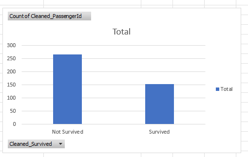
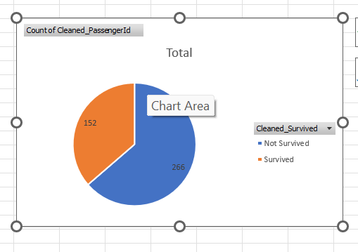

# SCT_DS_2
# Skill Craft Technology Internship — Task 2
*Exploratory Data Analysis (EDA) on Titanic Dataset using Excel*
This task focuses on cleaning and analyzing the Titanic dataset to uncover survival patterns using Excel tools like formulas, pivot tables, and charts.
# Folder Structure
- `task2_titanic_eda/`
  - `task2(SK).csv`: Cleaned Titanic dataset with survival labels
- `images/`
  - `bar_chart.png`: Bar chart showing survival counts
  - `pie_chart.png`: Pie chart showing survival proportions
 # Key Steps
- Created cleaned columns:
  - `Cleaned_PassengerId`: Validated passenger IDs
  - `Cleaned_Survived`: Converted binary survival status to readable labels
- Built a PivotTable to summarize survival counts
- Visualized survival data using:
  - Bar chart (Survival Count)
  - Pie chart (Survival Proportion)
# Insight
Out of 418 passengers:
- **152 survived**
- **266 did not survive**
- → Survival rate ≈ **36%**
# Visuals
# Bar Chart: Survival Count  

# Pie Chart: Survival Proportion  

#  Tools Used
- Microsoft Excel
- PivotTable
- Chart Builder
- GitHub for version control
